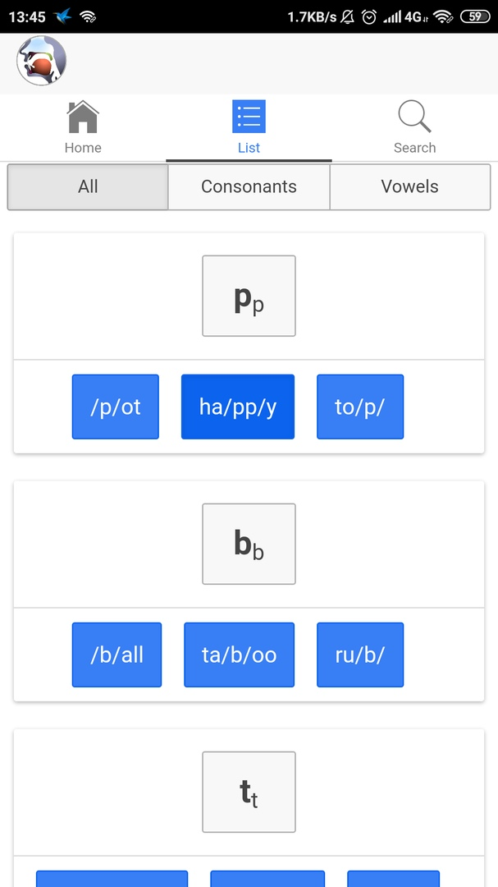

# Задание
1. Установите приложение Sounds of Speech
2. Составьте полный список его разделов и функций
3. Сделайте аннотированные скриншоты экранов приложения
4. Опишите последовательность действий, необходимых для тренировки
произношения дифтонгов с помощью данного приложения.
5. Разместите отчёт (лог действий) в репозитории (веб-портфолио).

# Решение
2,3. Список разделов:
  - На экране Home можно выбрать изучаемый язык, посмотреть авторов приложения
  
  - На экране search можно найти английское слово чтобы потренировать его произношение
  
  - На экране list представлено несколько разделов:
    - В разделе All - Находятся все звуки английского языка, нажимая на которые можно посмотреть видео как они произносятся. 
    - В разделе consonants, представлены звыки согласных букв. 
    - В разделе vowels звуки гласных.
  
4. Последовательность действий:
  - Найти английское слово, произношение которого вы хотите тренировать, на экране поиска. Приложение отобразит из каких звуков состоит слово.
  - Нажимать на каждый звук поочереди, прослушав как они произносятся
  - Записать свое произношение на диктофон
  - Сравнить свое произношение со звуками из приложения

