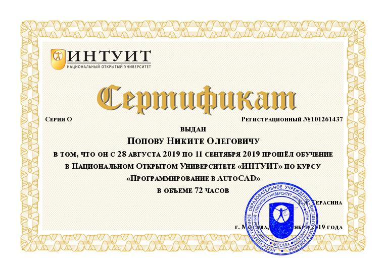
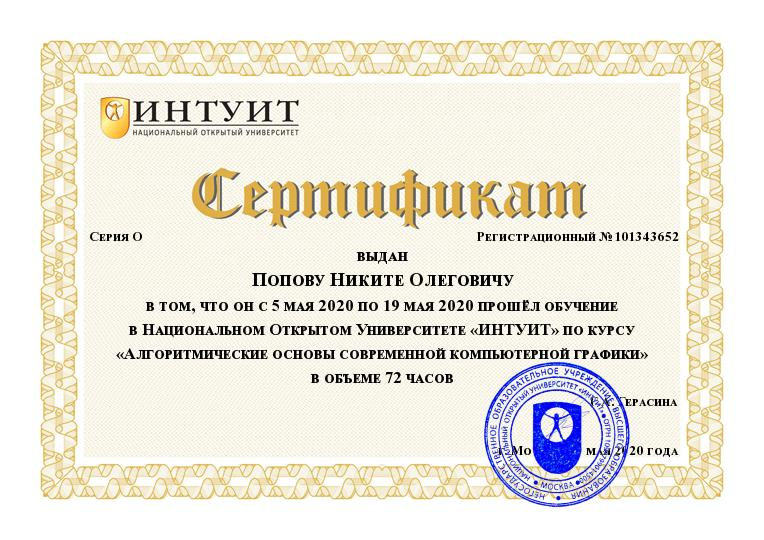
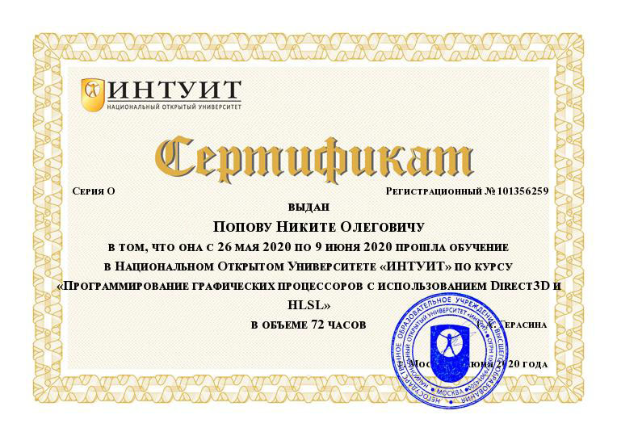
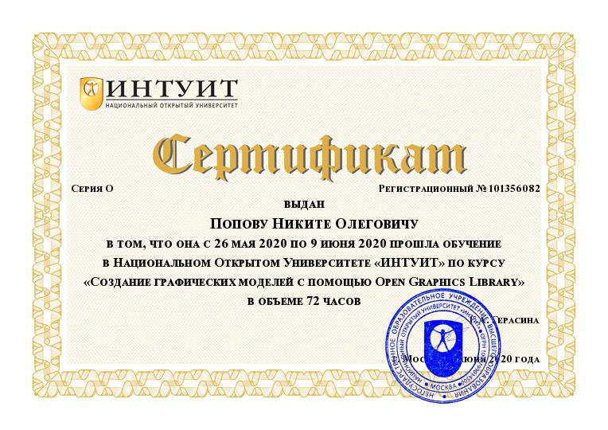

# Портфолио по компьютерной графике

> Выполнил Попов Никита. ИВТ. 3 курс.

## 6 семестр

### OpenGL:

[Лабораторная 1](https://github.com/NikitaPO/NikitaPLabs/tree/master/computer_graphics/openGL/PopovNLab1)  
[Лабораторная 2](https://github.com/NikitaPO/NikitaPLabs/tree/master/computer_graphics/openGL/PopovNLab2/)  
[Лабораторная 3](https://github.com/NikitaPO/NikitaPLabs/tree/master/computer_graphics/openGL/PopovNLab3/)  
[Лабораторная 4](https://github.com/NikitaPO/NikitaPLabs/tree/master/computer_graphics/openGL/PopovNLab4/)  
[Лабораторная 5](https://github.com/NikitaPO/NikitaPLabs/tree/master/computer_graphics/openGL/PopovNLab5/)  
[Лабораторная 6](https://github.com/NikitaPO/NikitaPLabs/tree/master/computer_graphics/openGL/PopovNLab6/)  
[Лабораторная 7](https://github.com/NikitaPO/NikitaPLabs/tree/master/computer_graphics/openGL/PopovNLab7/)  
[Лабораторная 8](https://github.com/NikitaPO/NikitaPLabs/tree/master/computer_graphics/openGL/PopovNLab8/)  
[Лабораторная 9](https://github.com/NikitaPO/NikitaPLabs/tree/master/computer_graphics/openGL/PopovNLab9/)  
[Лабораторная 10](https://github.com/NikitaPO/NikitaPLabs/tree/master/computer_graphics/openGL/PopovNLab10/)  
[Лабораторная 11](https://github.com/NikitaPO/NikitaPLabs/tree/master/computer_graphics/openGL/PopovNLab11/)  
[Лабораторная 12](https://github.com/NikitaPO/NikitaPLabs/tree/master/computer_graphics/openGL/PopovNLab12/)  
[Лабораторная 13](https://github.com/NikitaPO/NikitaPLabs/tree/master/computer_graphics/openGL/PopovNLab13/)  
[Лабораторная 14](https://github.com/NikitaPO/NikitaPLabs/tree/master/computer_graphics/openGL/PopovNLab14/)  
[Лабораторная 15](https://github.com/NikitaPO/NikitaPLabs/tree/master/computer_graphics/openGL/PopovNLab15/)  
[Лабораторная 16](https://github.com/NikitaPO/NikitaPLabs/tree/master/computer_graphics/openGL/PopovNLab16/)  
[Лабораторная 17](https://github.com/NikitaPO/NikitaPLabs/tree/master/computer_graphics/openGL/PopovNLab17/)  
[Лабораторная 18](https://github.com/NikitaPO/NikitaPLabs/tree/master/computer_graphics/openGL/PopovNLab18/)  
[Лабораторная 19](https://github.com/NikitaPO/NikitaPLabs/tree/master/computer_graphics/openGL/PopovNLab19/)  
[Лабораторная 20](https://github.com/NikitaPO/NikitaPLabs/tree/master/computer_graphics/openGL/PopovNLab20/)  
[Лабораторная 21](https://github.com/NikitaPO/NikitaPLabs/tree/master/computer_graphics/openGL/PopovNLab21/)  
[Лабораторная 22](https://github.com/NikitaPO/NikitaPLabs/tree/master/computer_graphics/openGL/PopovNLab22/)  
[Лабораторная 23](https://github.com/NikitaPO/NikitaPLabs/tree/master/computer_graphics/openGL/PopovNLab23/)  
[Лабораторная 24](https://github.com/NikitaPO/NikitaPLabs/tree/master/computer_graphics/openGL/PopovNLab24/)  
[Лабораторная 25](https://github.com/NikitaPO/NikitaPLabs/tree/master/computer_graphics/openGL/PopovNLab25/)  
[Лабораторная 26](https://github.com/NikitaPO/NikitaPLabs/tree/master/computer_graphics/openGL/PopovNLab26/)  
[Лабораторная 28](https://github.com/NikitaPO/NikitaPLabs/tree/master/computer_graphics/openGL/PopovNLab28/)   
[Лабораторная 30](https://github.com/NikitaPO/NikitaPLabs/tree/master/computer_graphics/openGL/PopovNLab30/)  
[Лабораторная 31](https://github.com/NikitaPO/NikitaPLabs/tree/master/computer_graphics/openGL/PopovNLab31/)  
[Лабораторная 32](https://github.com/NikitaPO/NikitaPLabs/tree/master/computer_graphics/openGL/PopovNLab32/)  
[Лабораторная 33](https://github.com/NikitaPO/NikitaPLabs/tree/master/computer_graphics/openGL/PopovNLab33/)  
[Лабораторная 34](https://github.com/NikitaPO/NikitaPLabs/tree/master/computer_graphics/openGL/PopovNLab34/)  
[Лабораторная 35](https://github.com/NikitaPO/NikitaPLabs/tree/master/computer_graphics/openGL/PopovNLab35/)  
[Лабораторная 36](https://github.com/NikitaPO/NikitaPLabs/tree/master/computer_graphics/openGL/PopovNLab36/)    
[Лабораторная 39](https://github.com/NikitaPO/NikitaPLabs/tree/master/computer_graphics/openGL/PopovNLab39/)  
[Лабораторная 46](https://github.com/NikitaPO/NikitaPLabs/tree/master/computer_graphics/openGL/PopovNLab46/)  

## Сертификаты

Сертификат программирование в AutoCAD

Сертификат проектирование в AutoCAD

Сертификат алгоритмические основы компьютерной графики

Сертификат программирование графически процессов

Сертификат создание графических моделей OpenGL

