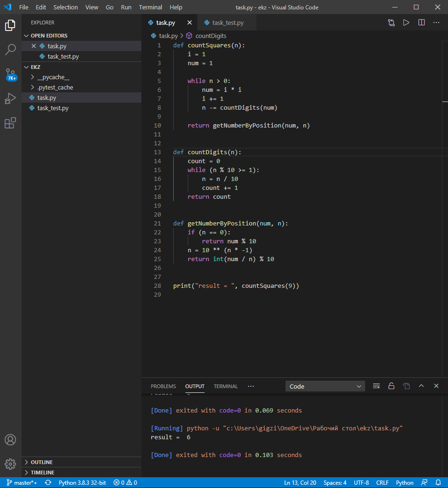
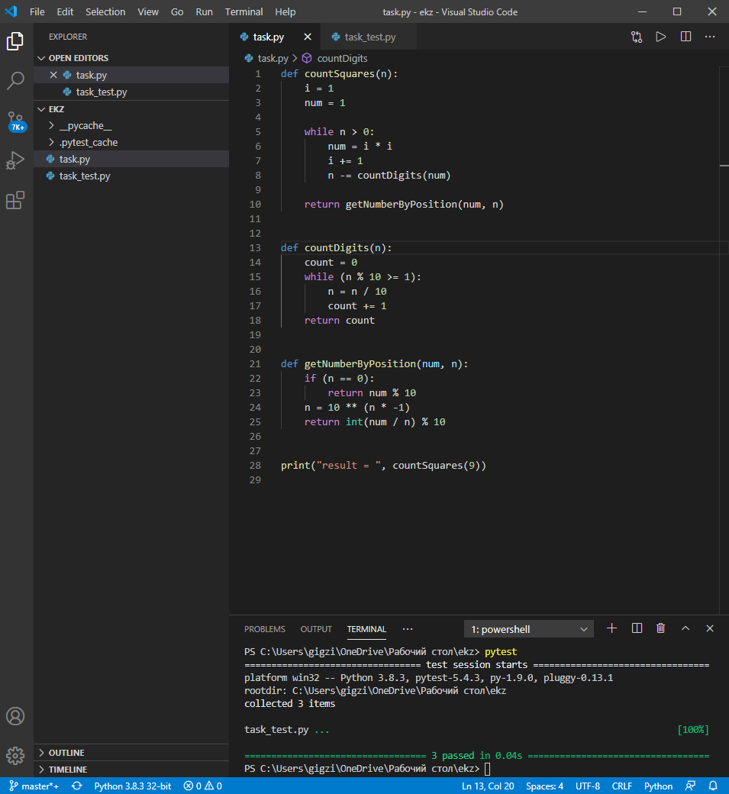

# Задание

Найти n-ю цифру последовательности из квадратов целых чисел:
149162536496481100121144...
Например, 2-я цифра равна 4, 7-я 5, 12-я 6.
Использовать операции со строками в этой задаче запрещается.

# Решение

## Код программы  

[Ссылка на файл](/task.py)

## Тестирование  

[Ссылка на файл](/task_test.py)
